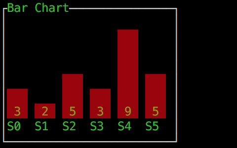
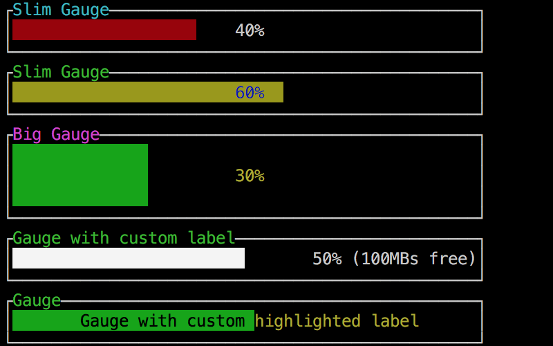

# termui


termui is a cross-platform and fully-customizable terminal dashboard and widget library built on top of [termbox-go](https://github.com/nsf/termbox-go). It is inspired by [blessed-contrib](https://github.com/yaronn/blessed-contrib) and written purely in Go.

## Installation

Installing from the master branch is recommended:

```bash
go get -u github.com/gizak/termui@master
```

**Note**: termui is currently undergoing API changes so make sure to check the changelog when upgrading.
If you upgrade and notice something is missing or don't like a change, revert the upgrade and open an issue.

## Usage

### Hello World

```go
package main

import (
	"log"

	ui "github.com/gizak/termui"
	"github.com/gizak/termui/widgets"
)

func main() {
	if err := ui.Init(); err != nil {
		log.Fatalf("failed to initialize termui: %v", err)
	}
	defer ui.Close()

	p := widgets.NewParagraph()
	p.Text = "Hello World!"
	p.SetRect(0, 0, 25, 5)

	ui.Render(p)

	for e := range ui.PollEvents() {
		if e.Type == ui.KeyboardEvent {
			break
		}
	}
}
```

### Widgets

Click image to see the corresponding demo codes.

[](https://github.com/gizak/termui/blob/master/_examples/barchart.go)
[](https://github.com/gizak/termui/blob/master/_examples/gauge.go)
[](https://github.com/gizak/termui/blob/master/_examples/linechart.go)
[](https://github.com/gizak/termui/blob/master/_examples/list.go)
[](https://github.com/gizak/termui/blob/master/_examples/paragraph.go)
[](https://github.com/gizak/termui/blob/master/_examples/sparkline.go)
[](https://github.com/gizak/termui/blob/master/_examples/stacked_barchart.go)
[](https://github.com/gizak/termui/blob/master/_examples/table.go)

### Examples

Examples can be found in [\_examples](./_examples). Run an example with `go run _examples/{example}.go` or run all of them consecutively with `make run-examples`.

### Documentation

- [wiki](https://github.com/gizak/termui/wiki)

## Uses

- [cjbassi/gotop](https://github.com/cjbassi/gotop)
- [go-ethereum/monitorcmd](https://github.com/ethereum/go-ethereum/blob/96116758d22ddbff4dbef2050d6b63a7b74502d8/cmd/geth/monitorcmd.go)

## Related Works

- [blessed-contrib](https://github.com/yaronn/blessed-contrib)
- [tui-rs](https://github.com/fdehau/tui-rs)
- [gocui](https://github.com/jroimartin/gocui)

## License

[MIT](http://opensource.org/licenses/MIT)
