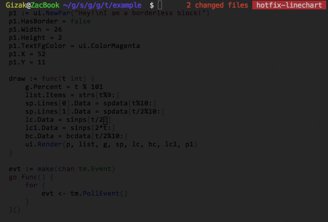

# termui
Go terminal dashboard. Inspired by [blessed-contrib](https://github.com/yaronn/blessed-contrib), but purely in Go.

Cross-platform, easy to compile, and fully-customizable.

__Demo:__



## Installation

	go get github.com/gizak/termui

## Usage

Each component's layout is a bit like HTML block (box model), which has border and padding.

The `Border` property can be chosen to hide or display (with its border label), when it comes to display, the label takes 1 padding space (i.e. in css: `padding: 1;`, innerHeight and innerWidth therefore shrunk by 1).

`````go
	import ui "github.com/gizak/termui" // <- ui shortcut, optional

	func main() {
		err := ui.Init()
		if err != nil {
			panic(err)
		}
		defer ui.Close()

		p := ui.NewPar(":PRESS q TO QUIT DEMO")
		p.Height = 3
		p.Width = 50
		p.TextFgColor = ui.ColorWhite
		p.Border.Label = "Text Box"
		p.Border.FgColor = ui.ColorCyan

		g := ui.NewGauge()
		g.Percent = 50
		g.Width = 50
		g.Height = 3
		g.Y = 11
		g.Border.Label = "Gauge"
		g.BarColor = ui.ColorRed
		g.Border.FgColor = ui.ColorWhite
		g.Border.LabelFgColor = ui.ColorCyan

		ui.Render(p, g)

		// event handler...
	}
`````

Note that components can be overlapped (I'd rather call this a feature...), `Render(rs ...Renderer)` renders its args from left to right (i.e. each component's weight is arising from left to right).

## Themes

_All_ colors in _all_ components _can_ be changed at _any_ time, while there provides some predefined color schemes:

```go
// for now there are only two themes: default and helloworld
termui.UseTheme("helloworld")

// create components...
```
The `default ` theme's settings depend on the user's terminal color scheme, which is saying if your terminal default font color is white and background is white, it will be like:


The `helloworld` color scheme drops in some colors!


## Widgets

_APIs are subject to change, docs will be added after 1 or 2 commits_

## GoDoc

[godoc](https://godoc.org/github.com/gizak/termui).

## License
This library is under the [MIT License](http://opensource.org/licenses/MIT)
