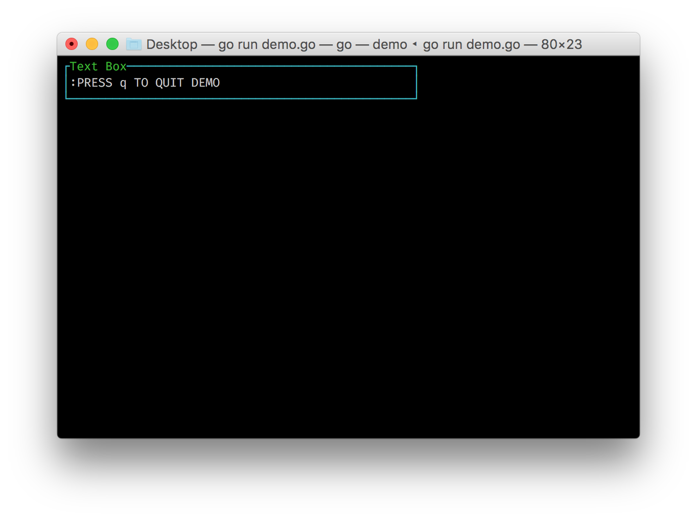

Installation
---

Since [termui](https://github.com/gizak/termui) is a Go lib, we will need a working Go environment to begin with. If you have not set it up, there is a great intro you can follow up: [How to write Go code](https://golang.org/doc/code.html).

Once you have the environment set up, you can proceed to install termui by the following command:

`go get github.com/gizak/termui`

The current version of termui is v2. If you are working with the old version of termui or the new version does not seem right to you, you can always go back to v1 version by:

`go get gopkg.in/gizak/termui.v1`

!!! note
	v2 has many features implemented which you can not find in v1, such as new event system and asynchronous rendering. To find more about versions difference in section [Versions](versions.md).


Usage
---

Let's throw an simple example to get our feet wet:

```go
package main

import ui "github.com/gizak/termui" // use ui as an alias

func main() {
	err := ui.Init()
	if err != nil {
		panic(err)
	}
	defer ui.Close()

	p := ui.NewPar(":PRESS q TO QUIT DEMO")
	p.Height = 3
	p.Width = 50
	p.TextFgColor = ui.ColorWhite
	p.BorderLabel = "Text Box"
	p.BorderFg = ui.ColorCyan

	ui.Render(p) // feel free to call Render, it's async and non-block

    ui.Handle("/sys/kbd/q",func(e ui.Event){
		ui.StopLoop()
	})

	ui.Loop()
}
```
There are only around 20 lines for the main function. Break this down into 4 parts:

1. __Init termui__:
   `ui.Init()`  initializes the termui. From this point, termui will take over your terminal display.
   `ui.Close()` closes resources and cleans up your terminal content. Make sure it is called before exit or you will end up with a messed up looking terminal.

2. __Build your component__:
   `ui.NewPar(:PRESS q TO QUIT DEMO)` returns a structure representing a paragraph component. You can assign position, size, text colour, border and many other properties to a component.

3. __Draw your component on display__:
   `ui.Render(p)` renders p onto terminal display.

4. __Handle events__:
   `ui.Handle("/sys/kbd/q", func(e Event))` registers an event handler for event: key q is pressed.
   `ui.StopLoop()` exits the event listening loop invoked by `ui.Loop()`.
   `ui.Loop()` makes the program stops at here and start listening & handling events. Call
   `ui.StopLoop()` to leave the circle.

The example code gives us:

> 

Now you can press q to quit the program.

After knowing of some basics, next we can discover more about:

1. how to set component location in [Layouts](layouts.md)
2. how to capture and handle events in [Events](events.md)
3. the different [components](components.md)
4. check out some real world examples in [recipes](recipes.md)
